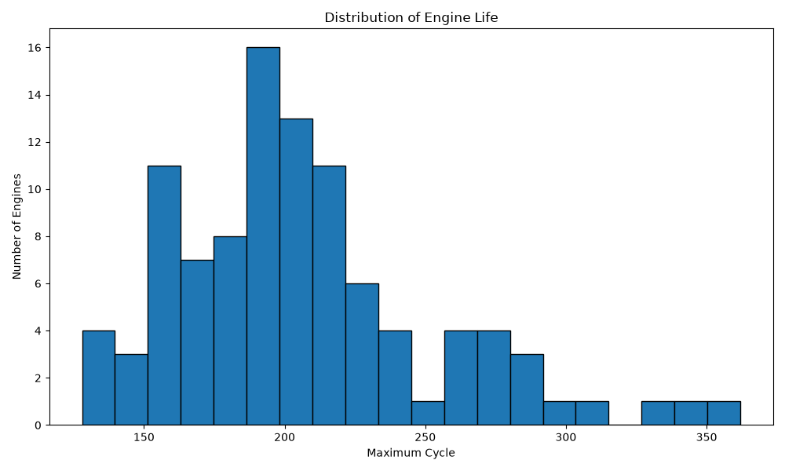
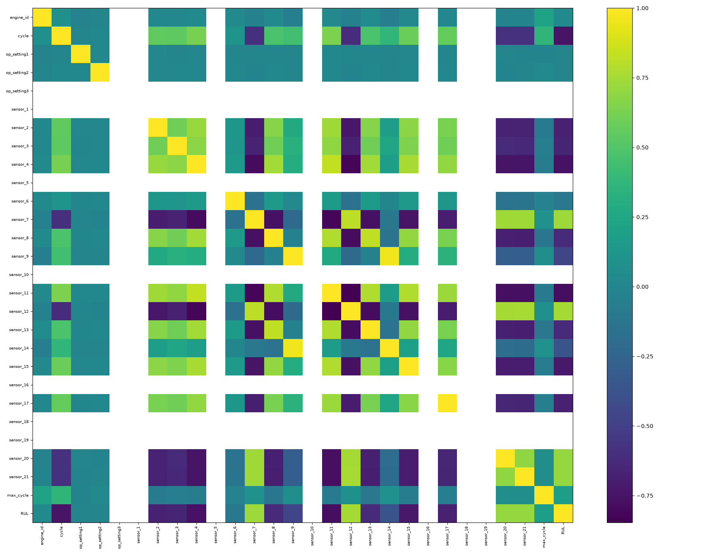
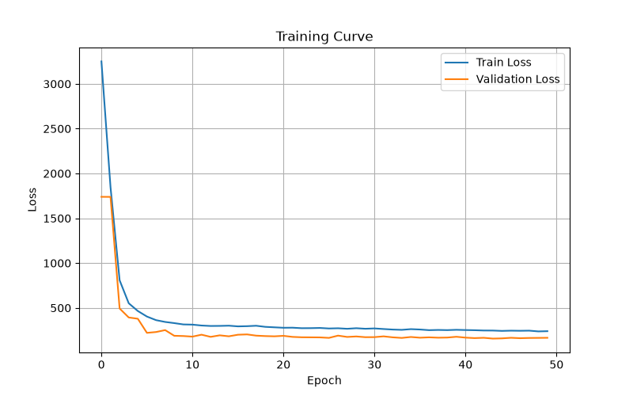
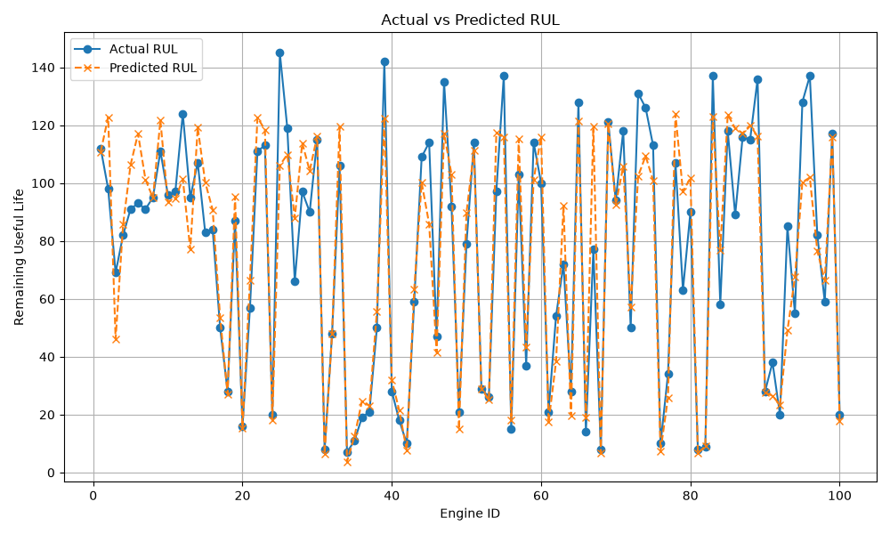

# Predictive Maintenance using LSTM

This project implements an end-to-end **Remaining Useful Life (RUL) prediction system** using the NASA C-MAPSS FD001 aircraft engine dataset. The project uses sensor time-series data and a PyTorch LSTM model to estimate how many operational cycles an engine has remaining before failure.

The project includes data preprocessing, feature scaling, sequence generation, LSTM model training, inference, evaluation, visualization, and a Streamlit dashboard.

## Project Results

| Metric   |           Result |
| -------- | ---------------: |
| MAE      | **10.83 cycles** |
| RMSE     | **14.63 cycles** |
| R² Score |       **0.8760** |

The model achieves an R² score of **0.876**, meaning it explains approximately 87.6% of the variation in the engine RUL values on the evaluated test set.

---

## Repository Structure

```text
RUL_Prediction_Project/
│
├── app.py
│
├── dataset/
│   ├── train_FD001.txt
│   ├── test_FD001.txt
│   ├── RUL_FD001.txt
│   └── processed/
│       ├── train_processed.csv
│       ├── test_processed.csv
│       └── rul_processed.csv
│
├── src/
│   ├── preprocess.py
│   ├── dataset.py
│   ├── model.py
│   ├── train.py
│   ├── predict.py
│   └── evaluate.py
│
├── models/
│   └── best_model.pth
│
├── results/
│   ├── engine_life_distribution.png
│   ├── rul_distribution.png
│   ├── correlation_heatmap.png
│   ├── loss_curve.png
│   ├── predictions.csv
│   ├── actual_vs_predicted_rul.png
│   └── scatter_plot.png
│
├── requirements.txt
└── README.md
```

---

## Technologies Used

* Python
* PyTorch
* Pandas
* NumPy
* Scikit-learn
* Matplotlib
* Streamlit

---

## Dataset

The project uses the **NASA C-MAPSS FD001** turbofan engine degradation dataset.

The dataset contains:

* Engine ID
* Operating cycles
* 3 operating-condition variables
* 21 sensor measurements
* RUL target generated from engine failure cycles

The training dataset contains **20,631 observations** and 26 original columns.

---

# Project Workflow

```text
NASA C-MAPSS Dataset
        │
        ▼
Data Preprocessing
        │
        ├── Load raw TXT files
        ├── Assign column names
        ├── Calculate maximum engine cycle
        └── Calculate RUL
        │
        ▼
Feature Selection
        │
        ├── 3 Operating Settings
        └── 21 Sensor Features
        │
        ▼
MinMax Scaling
        │
        ▼
Time-Series Sequence Generation
        │
        └── Window Size = 30 cycles
        │
        ▼
Train / Validation Split
        │
        ▼
LSTM Model
        │
        ├── 2 LSTM Layers
        ├── Hidden Size = 128
        ├── Fully Connected Layer = 64
        ├── ReLU
        └── Dropout = 0.3
        │
        ▼
Model Training
        │
        ├── Adam Optimizer
        ├── MSE Loss
        ├── Learning Rate = 0.001
        └── Early Stopping
        │
        ▼
Best Model
        │
        ▼
RUL Prediction
        │
        ▼
Model Evaluation
        │
        ├── MAE
        ├── RMSE
        └── R²
        │
        ▼
Streamlit Dashboard
```

---

# Model Architecture

The project uses a sequence-based LSTM neural network.

```text
Input
30 time steps × 24 features
        │
        ▼
LSTM Layer 1
Hidden Size = 128
        │
        ▼
LSTM Layer 2
Hidden Size = 128
        │
        ▼
Fully Connected
128 → 64
        │
        ▼
ReLU
        │
        ▼
Dropout
0.3
        │
        ▼
Fully Connected
64 → 1
        │
        ▼
Predicted RUL
```

The model receives **30 consecutive operating cycles** and uses the temporal information from the sensor measurements to predict RUL.

---

# 1. Data Preprocessing

Run:

```bash
python src/preprocess.py
```

The preprocessing pipeline:

1. Loads the NASA C-MAPSS TXT files.
2. Assigns column names.
3. Groups data by engine.
4. Determines the maximum operating cycle of each engine.
5. Calculates RUL for each training observation.
6. Saves processed datasets.
7. Generates exploratory visualizations.

Generated files:

```text
dataset/processed/
├── train_processed.csv
├── test_processed.csv
└── rul_processed.csv
```

---

# 2. Dataset Preparation

Run:

```bash
python src/dataset.py
```

The dataset pipeline:

* Loads processed datasets.
* Selects operating settings and sensor measurements.
* Applies MinMax scaling.
* Creates 30-cycle sliding windows.
* Generates training, validation, and testing sequences.
* Converts data into PyTorch tensors.
* Creates PyTorch DataLoaders.

Example input:

```text
Batch Size = 64
Sequence Length = 30
Features = 24
```

Therefore:

```text
Input Tensor:
[64, 30, 24]
```

---

# 3. Train the LSTM Model

Run:

```bash
python src/train.py
```

Training configuration:

```text
Epochs       : 50
Batch Size   : 64
Learning Rate: 0.001
Hidden Size  : 128
LSTM Layers  : 2
Dropout      : 0.3
Loss         : MSELoss
Optimizer    : Adam
```

The training process uses validation loss and saves the best-performing model checkpoint.

Output:

```text
models/best_model.pth
```

Training visualization:

```text
results/loss_curve.png
```

---

# 4. Generate Predictions

Run:

```bash
python src/predict.py
```

The prediction pipeline:

1. Loads the trained LSTM model.
2. Loads the test sequences.
3. Runs inference.
4. Loads the actual RUL values.
5. Compares actual and predicted RUL.
6. Saves the prediction results.

Output:

```text
results/predictions.csv
```

Example:

```text
engine_id,cycle,actual_RUL,predicted_RUL
1,31,112,110.80183
2,49,98,122.77836
3,126,69,46.070827
4,106,82,85.60244
```

---

# 5. Model Evaluation

Run:

```bash
python src/evaluate.py
```

The model is evaluated using:

### MAE

Mean Absolute Error measures the average absolute difference between actual and predicted RUL.

### RMSE

Root Mean Squared Error gives greater penalty to larger prediction errors.

### R²

R² measures how well the model explains the variation in the target RUL values.

Current results:

```text
============================================================
MODEL EVALUATION
============================================================
MAE  : 10.8338
RMSE : 14.6307
R2   : 0.8760
============================================================
```

---

# Results and Visualizations

## Engine Life Distribution



Shows the distribution of operating cycles across the training engines.

---

## RUL Distribution


Shows the distribution of Remaining Useful Life values used during training.

---

## Sensor Correlation Heatmap



Shows correlations between operating conditions and sensor measurements.

---

## Training and Validation Loss



Shows the training and validation loss during LSTM model training.

---

## Actual vs Predicted RUL



Compares actual engine RUL values with the RUL predicted by the trained model.

---

# Prediction Results

The model produces an individual RUL prediction for each test engine.

Example:

```text
Engine 1
Actual RUL    : 112
Predicted RUL : 110.80
```

```text
Engine 2
Actual RUL    : 98
Predicted RUL : 122.78
```

```text
Engine 3
Actual RUL    : 69
Predicted RUL : 46.07
```

The complete predictions are stored in:

```text
results/predictions.csv
```

---

# Streamlit Dashboard

The project also includes an interactive Streamlit dashboard.

Run:

```bash
streamlit run app.py
```

The dashboard provides:

* Engine selection
* Predicted RUL
* Actual RUL
* Engine health indication
* Model performance metrics
* Prediction visualization

The dashboard uses:

```text
models/best_model.pth
results/predictions.csv
```

---

# Installation

Clone the repository:

```bash
git clone <YOUR_GITHUB_REPOSITORY_URL>
cd RUL_Prediction_Project
```

Create a virtual environment:

```bash
python -m venv .venv
```

Activate it on Windows:

```bash
.venv\Scripts\activate
```

Install dependencies:

```bash
pip install -r requirements.txt
```

Or install manually:

```bash
pip install numpy pandas matplotlib scikit-learn torch streamlit
```

---

# Recommended Execution Order

Run the project in this order:

```bash
python src/preprocess.py
```

```bash
python src/dataset.py
```

```bash
python src/train.py
```

```bash
python src/predict.py
```

```bash
python src/evaluate.py
```

Finally:

```bash
streamlit run app.py
```

---

# Key Features

* Real-world industrial predictive maintenance dataset
* Time-series sensor analysis
* RUL calculation
* Feature scaling
* Sliding-window sequence generation
* PyTorch LSTM model
* Early stopping
* Best-model checkpointing
* RUL regression
* MAE, RMSE and R² evaluation
* Prediction visualization
* Interactive Streamlit dashboard

---

# Future Improvements

The current implementation provides a strong LSTM baseline. Future improvements can include:

* CNN-LSTM architecture
* Bidirectional LSTM
* Attention mechanism
* Transformer-based RUL prediction
* SHAP-based sensor explainability
* Hyperparameter optimization
* GPU acceleration
* Real-time sensor prediction
* Improved predictive maintenance dashboard

---

# Author

**Ashish Yadav**
NIT Jamshedpur
M.Tech — Communication System Engineering

This project was developed to demonstrate practical skills in:

* Machine Learning
* Deep Learning
* Time-Series Analysis
* Predictive Maintenance
* Python
* PyTorch
* Data Engineering
* Model Evaluation
* Deployment with Streamlit
